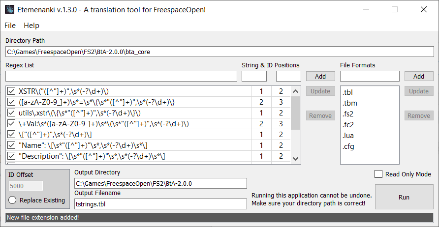

 

  

  <h3 align="center">Etemenanki</h3>

  

    A translation tool for FreespaceOpen!
  

## About

Etemenanki is a tool meant to facilitate creating a full tstrings.tbl for games in the [FreespaceOpen engine](https://github.com/scp-fs2open/fs2open.github.com). It recursively scans a directory for valid files and uses regex to find translatable strings and string IDs. It will then replace the ID with a valid one and save the string and ID to the generated tstrings.tbl file.

Etemenanki uses [QT Designer](https://www.qt.io/product/ui-design-tools) for it's UI development.

## Usage

Etemenanki will scan the provided directory for parsable files. It will then search each file with each provided Regex to try to find possible matches for translatable strings. If a match is found it will decipher the ID and check that it is both unique and not invalid*. If necessary it will provide a new unique string ID. Then the string and the ID will be saved to the output file in a proper [tstrings.tbl format](https://wiki.hard-light.net/index.php/Tstrings.tbl) for the FreepsaceOpen Engine.

Below is an explenation of the home settings:

* Directory Path: The root path to the game files you want to run Etemenanki on.
* Regex List: The [Regular Expressions](https://en.wikipedia.org/wiki/Regular_expression) to be used when searching for translatable strings and IDs. Each expression also needs to specify which of the patterns in the expression are the string and the ID. This is done with index values from left to right starting with 1.
* File Formats List: In order to speed up the process, Etemenanki will only parse files with extensions listed here. All other files will be ignored.
* ID Offset: By default Etemenanki will generate new string IDs at 0, but you can provide an optional offset here instead.
* Replace Existing: By default Etemenanki will not replace strings that have an existing valid ID. Check this button if you would like to change that behavior.

Below is an explenation of the preferences settings:

* Comprehensive Scan: This setting will force a complete scan of the game files before any action is taken. Etemenanki will then generate new string IDs ensuring no conflicts. After that it will begin modifying files. This process can take twice as long as a normal scan. Note that if Replace Existing is set then this setting will be ignored.
* Fill In Missing IDs: This setting will force the scan to attempt to fill in any missing IDs in the sequence between 0 and maximum ID before creating IDs beyond the current maximum. Any ID Offset will be ignored if this is option is turned on.  Note that if Replace Existing is set then this setting will be ignored.
* Output File Sorting: You can set your preferred soring method for the output file.
* Output File Header Annotations: If set then Etemenanki will print a commented out line before each pair that will list the first file the pair was found in. If sorting by filename, it will only do this once per group.
* Verbose Output File Annotations: If set then Etemenanki will print a commented out line for every pair that lists all files the pair was found in.
* Use Case-Insensitive String Comparisons: By default Etemenanki is case sensitive. If this is set then all string comparisons for pair strings will be case insensitive.

Below is an explenation of the Ignore Files settings:

* Any file listed in this dialog will not be scanned even if it matches a valid file extension. The file listed here must contain the full path to the file and not just the filename.

Below is an explenation of the Ignore Ids settings:

* Any ID listed in this dialog will not be allowed in any case and will be considered invalid. This is useful if you have some types of string/id pairs that cannot be effectively searched with Regex and must be done manually.

When your settings are correct, click Begin and Etemenanki will begin processing your game files. The output will list any terminal errors, otherwise it will display the file it is currently parsing. A full output log can be found in %appdata%/Etemenanki/Etemenanki.log if needed.

You may Terminate the process at any time by clicking on Terminate, but the action cannot be undone! Any files that have been processed may have already been altered. It is a good idea to use this in conjunction with a versioning system like GIT or SVN which can then be used to verify Etemenanki's output.

*Invalid IDs are IDs where two strings share an ID but the strings are not identical

## Known Issues

- None currently!
